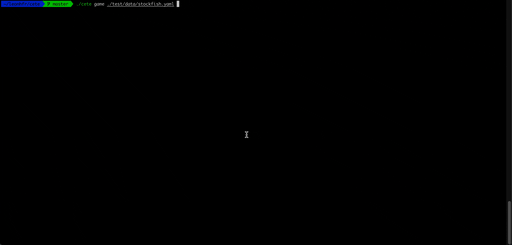
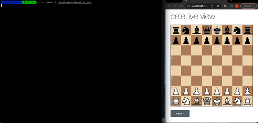

# cete

Cete is a CLI to pit UCI-compliant chess engines against each other.

## Installation

Installation is only done via the `go` command for now:

```sh
go install github.com/leonhfr/cete@latest
```

Binaries are also available for direct download in the `Releases` tab.

## Quick start

### Terminal only



```sh
# Play a game using flags:
# Engines can be binaries in the PATH or file paths to the binaries:
cete --white stockfish --black ./honeybadger

# Play a game using a configuration file:
cete game ./test/data/stockfish.yaml
```

### Terminal and live view



```sh
# Just add the --broadcast (-b) flag, cete will wait for the user to press the start button in the live view
cete game -b ./test/data/stockfish.yaml
```

An example of a configuration can be found in `/test/data`.

## `/internal/uci`

`/internal/uci` is directly copied from [github.com/notnil/chess](https://github.com/notnil/chess). Waiting on [this PR](https://github.com/notnil/chess/pull/114) to be merged before reverting to the main repository!
